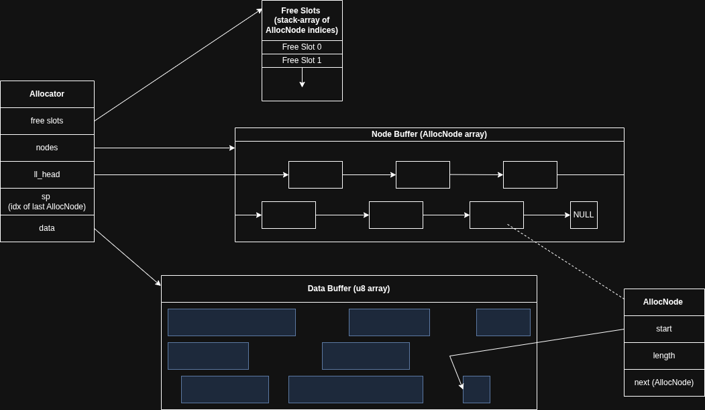

# General-Purpose Memory Allocator

A memory efficient GPA.

## Components
1. [Allocator](#Allocator)
2. [Free slots](#Free-Slots)
3. [Node buffer](#Node-Buffer)
4. [Data buffer](#Data-Buffer)

### Allocator
The main structure, it provides an interface with both alloc() and free().
It holds references to the other structures and additional data such as stack pointers, the head of the linked list, etc.

### Free Slots
A stack array of fixed sized free slots in the node buffer.
A stack pointer in the allocator holds the index of the latest free slot.

### Node Buffer
Buffer of fixed-sized nodes. Each node keeps track of an allocated chunk in the data buffer.
Inside the buffer, there is a linked list, with each node pointing towards the node with the closest allocation.
So, if a node n1 points to another node n2 via n1.next, 
then there cannot be a node n with dist(n.start, n1.start) >= dist(n2.start, n1.start), 
with the constraint that the allocated block of n is after n1 (so n1.start < n.start).

### Data Buffer
All allocated data is stored here. 
The alloc() function returns a pointer within the bounds of the data array.
Every free() call must reference data inside of the array.

